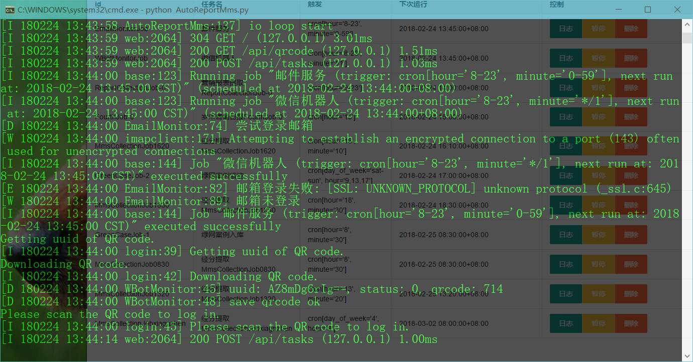
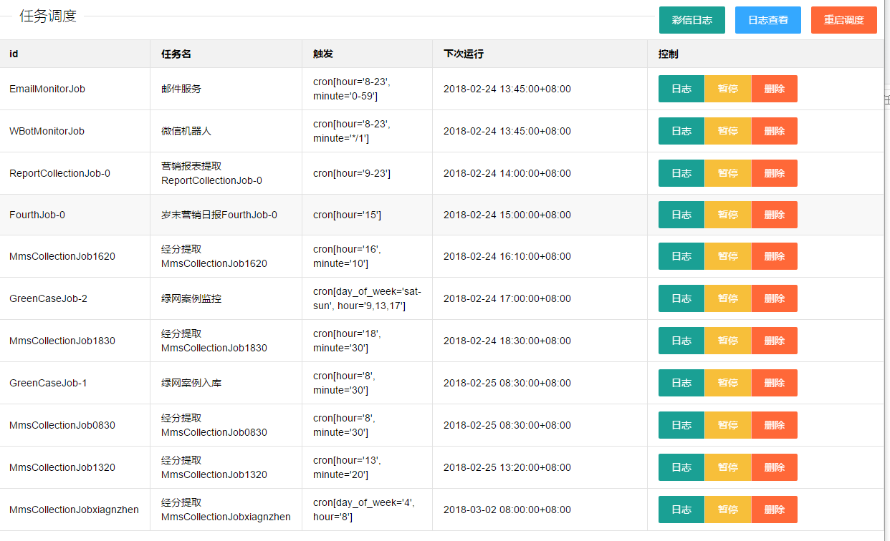
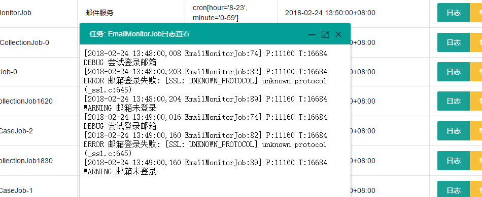
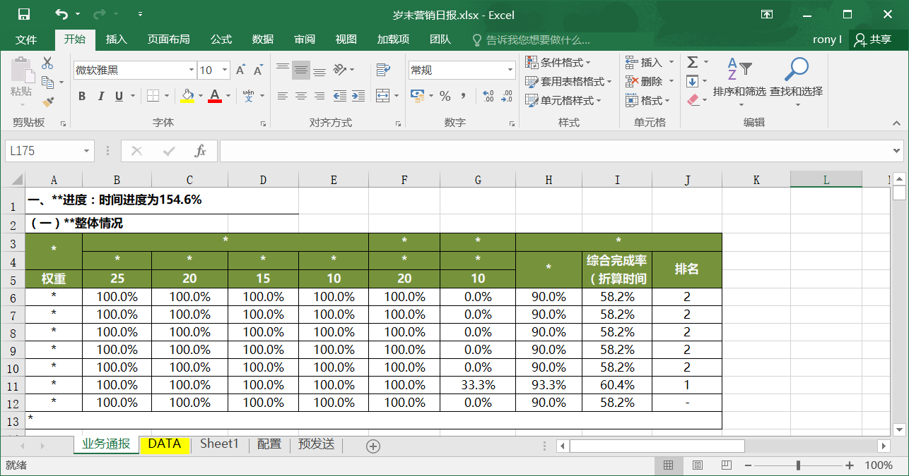
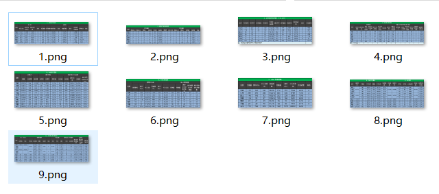

# 简单的自动化任务调度

需要Python3及以后版本

这里采用Python3.5

 - 通过命令行安装  pip install JPype1-0.6.2-cp35-cp35m-win32.whl
 - 通过命令行安装  pip install pandas-0.22.0-cp35-cp35m-win32.whl
 - pip install -r requirements.txt

# 截图

界面

其中一项日报模版

根据模版excel 生成的图片报表

# 说明
项目属于根据内部系统做的一款自动化采集、报表生成、微信自动发送、数据采集等一系列简单的任务调度系统，涉及敏感的信息均已修改。